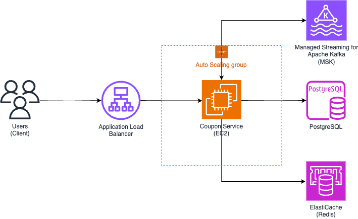

# coupon-management-system

대규모 쿠폰 발급 서비스의 아키텍쳐를 설계해보는 문서입니다.

## 요구사항(가정)

- 쿠폰은 **사용자에게 발급**되며, **중복 발급 방지**
- 쿠폰은 **유효기간**, **사용 조건**, **발급 수량 제한**을 가짐
- 트래픽 급증 (예: 이벤트성 대규모 발급 요청) 상황에서도 **성능 보장** -> 최대 3,000 RPS
- **분산 환경**에서도 **정합성 보장** 필요
- 쿠폰 사용은 **한 번만 가능**, 상태는 사용 전/후 관리

---

## 기술 스택 선정

| 계층             | 기술 스택                                 | 이유                                                         |
| ---------------- | ----------------------------------------- | ------------------------------------------------------------ |
| API Gateway      | AWS ALB로 대체                            | 단순히 쿠폰 발급 서비스만 고려하여 Auto Scaling이 가능한 ALB 선택 |
| Web Framework    | **Spring Boot (Kotlin)**                  | 대규모 트래픽 대응 가능, 개발 생태계 풍부                    |
| DB (쿠폰 메타)   | **PostgreSQL**                            | 쿠폰 정보 및 상태 관리에 적합, 동시성 제어에 강하고 정합성 우선 |
| Cache            | **Redis**                                 | 발급 중복 방지, 임시 저장, 락 구현                           |
| Queue            | **Kafka**                                 | 비동기 발급 처리, 고트래픽 방어                              |
| Distributed Lock | **Redisson (Redis 기반)**                 | 동시 발급 제어                                               |
| 인증/보안        | **JWT + OAuth2**                          | 사용자 인증 및 권한 검증                                     |
| Infra            | **Docker + Kubernetes**                   | MSA 기반 배포 및 확장성 고려                                 |
| Monitoring       | **Prometheus + Grafana**                  | 실시간 모니터링                                              |
| Logging          | **ELK (Elasticsearch, Logstash, Kibana)** | 로그 분석                                                    |

------

## 전체 아키텍처 구성도

------

## 쿠폰 발급 요청 흐름

### 전체 구성 요소

| 구성 요소                       | 설명                                            |
| ------------------------------- | ----------------------------------------------- |
| Users                           | 쿠폰 발급을 요청하는 클라이언트 (모바일, 웹 등) |
| ALB (Application Load Balancer) | 트래픽을 여러 EC2 인스턴스로 분산               |
| Auto Scaling Group (EC2)        | Spring Boot 기반 쿠폰 발급 서비스가 동작        |
| ElastiCache (Redis)             | 중복 발급 방지, TTL 캐시, 재고 감소 처리        |
| MSK (Kafka)                     | 비동기 처리용 메시지 큐                         |
| PostgreSQL                      | 쿠폰 정보, 사용자 발급 이력 등 영속 저장소      |

------

## 상세 요청 흐름

### 1. **사용자 쿠폰 발급 요청**

- 사용자가 쿠폰 발급 API를 호출
- 요청에는 JWT 인증 토큰과 쿠폰 ID 포함됨 (인증은 별도의 서버에서 받았다고 가정)

### 2. **ALB가 트래픽을 Spring Boot 서버로 라우팅**

- ALB는 요청을 Auto Scaling Group 내의 EC2 인스턴스 중 하나에 전달
- 이때 ALB는 상태가 정상인 인스턴스로만 분배

### 3. **쿠폰 서비스 애플리케이션에서 쿠폰 발급 처리**

- 쿠폰 서비스(Spring Boot)에서 JWT 검증 -> 내부의 인증로직을 직접구현하거나 외부 인증 서버를 통해 토큰 검증
- Redis에서 쿠폰 중복 발급 체크 (Redisson Lock)
- Redis에서 쿠폰 재고 감소 처리

### 4. Kafka (MSK)에 발급 메시지 전송

- 쿠폰이 유효하고 발급 조건 충족되면
- Kafka에 발급 요청 메시지를 발행

### 5. Kafka Consumer가 비동기 처리

- Consumer 서버가 이 메시지를 컨슈밍 및 처리 (여기에서는 Consumer 서버가 Producer 서버와 동일)
  - RDB(PostgreSQL)에 **발급 내역 저장**
  - 쿠폰 상태 업데이트 -> 발급 완료
  - 이메일, 알림, 또는 슬랙 메시지 전송 등 후처리

### 6. 클라이언트에 응답 반환

- 쿠폰 서비스는 Kafka에 메시지를 보내고 곧바로 응답 -> DB 작업은 Kafka를 컨슈밍하여 비동기처리

------

## 고려사항

- 쿠폰 중복 방지를 위해서 Redis Key의 TTL을 적절히 설정하려면?
- Kafka 메시지 중복을 방지하려면?
